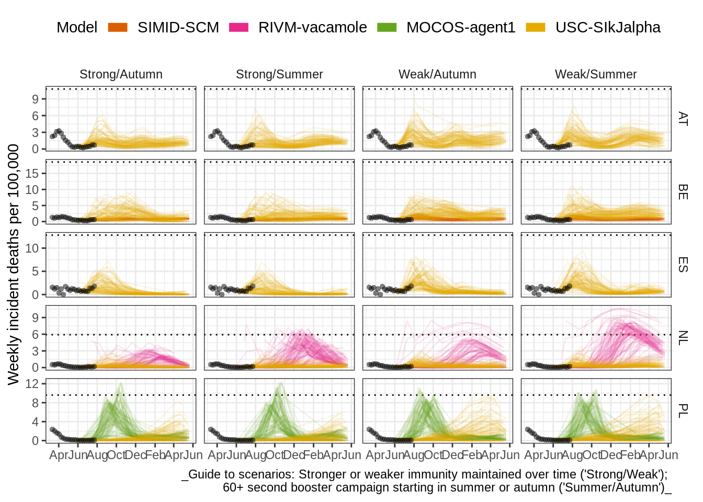

---
output:
  pdf_document:
    citation_package: natbib
bibliography: references.bib  
---

# Report of scenario modelling of the first 4 months

The scenario hub started with an initial meeting on 22 February 2022, followed
by two initial round of scenarios informed by policy questions relevant in the
European context. Here we describe briefly report results from the first 4
months: the *pilot round* (round 0) and the first full round of submissions
(round 1)

## Round 0

For this round we adopte identical scenarios to the US Scenario Hub
Round 13, with one axis of waning protection and another of the impact of new
variants. These were considered the most policy-relevant questions, with a
particular interest in which of these aspects were more relevant for determining
future outcomes and therefore be the focus of future monitoring. we asked teams
to start their projections on 13 March 2022.

We received projections from six models, of which two included results for nearly all (30 and 32) of the 32
available countries. One model contributed results for three countries (Austria, Germany, the UK), and the
remainder contributed projections for one country only (Denmark, Spain, and Poland, respectively).

In three of four scenarios, models projected repeated resurgence of COVID-19 burden across Europe continuing
over the next twelve months. Models projected no further major outbreaks of COVID-19 across Europe in
the most optimistic scenario that maintained a substantial level of protection against infection over a 10
month period, with no new viral strain. In contrast, even with this long-lasting protection, a new viral strain
occurring in May created some outbreaks over the following summer months, although with variation among
models (for example, one model suggesting a delayed winter wave in Denmark).

In contrast, we observed most epidemic activity when models assumed a faster rate of waning, regardless
of whether models introduced a new variant. With a median time to reduced protection against infection
of only 4 months, possible surges were projected over both summer and winter. Model results showed no
consistent timing or magnitude of activity, with variation both within scenarios across models and within
each model across scenarios even within the scenarios of either maintaining the mix of viral strains or
the introduction of a new more transmissible variant.

## Round 1

For round 1 we decided to depart from the scenarios used in the US to focus on
vaccination questions deemed of particular relevance by ECDC. Based on round 0
results suggesting that waning immunity was a stronger driver of future dynamics
than the emergence of new variants we retained optimistic and pessimistic waning
scenarios but instead of considering the introduction of new variants we added
two vaccination scenarios of a slow summer or fast autumn booster campaign. We
asked modellers to start their projections from 22 May 2022. 

In this round we received projections from 6 models, of which one covered all
countries. As a result, we did not have projections available from more than 2
models for any of the countries.

Across all scenarios, we observed very low or no probability of deaths over the
next year matching the previous year's total. This was not true of other
outcomes with comparative observed data (cases, hospitalisations). 

Comparing scenarios by immune assumptions, we observed higher total counts of
projected outcomes when immunity was modelled as weaker (a faster decline to a
reduced plateau of immunity). In these scenarios, in many countries the number
of cases projected over the next year approached or exceeded the total observed
over the last year. That said, recent data indicate the optimistic scenario of
immune waning may be more likely than the pessimistic scenario. Between
scenarios with strong immunity (-60% over 8 months), we observed relatively
little difference in cumulative outcomes between scenarios providing a summer or
an autumn booster campaign. 

Across scenarios for hospitalisations, we noted that peak sizes rarely
approached the highest level previously observed. We saw no systematic
difference in the number of peaks between scenarios modelling a booster campaign
in summer versus autumn, but as before, differences were more clearly between a
longer or shorter duration of waning immunity. Comparing projections for deaths,
we noticed that projected peaks shift to slightly later in the year with a
vaccination campaign in the summer compared to autumn, moving the likely timing
of a peak from late summer/autumn into winter. 

**Figure** *Projections of deaths for round 1, from the four models that
included deaths in their output, across the four scenarios (columns) and in the
five countries where more than one model was available (rows).**

## Round 2

For round 2 we aimed to create results that were relevant both for teams’
national policy work, and for cross-European policy setting for a vaccination
campaign in the autumn. We focussed on the target population for a second
booster vaccination among those aged 60+ or all 18+; combined with optimistic
and pessimistic scenarios for the effectiveness of a second booster dose. We can
see a wide range of plausible possibilities for the latter, from increased
effectiveness of new vaccines, to reduced effectiveness of existing vaccines
against new variants. As a result, we kept the quantification of these
scenarios particularly flexible and open to modellers’ independent judgement. 

At the time of writing of this report, results from round 2 were not yet available.
